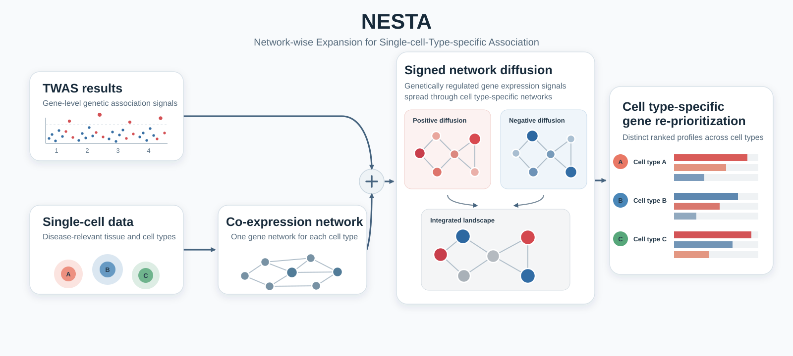

# NESTA

**Network-wise Expansion for Single-cell-Type-specific Association**



NESTA prioritizes disease-relevant genes by integrating gene-level TWAS
evidence with cell type-specific gene co-expression networks. Rather than
ranking genes by TWAS strength alone, NESTA propagates positive and negative
genetic signals through a disease-relevant cellular network and returns a
cell type-specific prioritization landscape.

## Quick start

The bundled tutorial uses a compact simulation-derived dataset with 18 genes
and two cell types. Once dependencies are installed, it runs the complete
example and verifies the expected cell type-specific rankings:

```bash
git clone https://github.com/Jaeseung-SONG/NESTA.git
cd NESTA
bash tutorial/run_tutorial.sh
```

See the [step-by-step tutorial](tutorial/README.md) for the input files,
command-line options, expected outputs, and interpretation.

## Installation

NESTA is implemented in R. Install the core packages with:

```r
install.packages(c("dplyr", "igraph", "optparse", "data.table", "BiocManager"))
BiocManager::install("diffuStats")
```

The lightweight edge-list workflow and quick-start tutorial do not require
Seurat or hdWGCNA. To read an existing hdWGCNA/Seurat expression-network RDS,
also install the versions of `Seurat` and `hdWGCNA` used to create that object.

## Inputs

NESTA requires two sources of information:

1. **TWAS results** containing gene symbols, Z-scores, and p-values.
2. **A reference gene network**, ideally a cell type-specific co-expression
   network from disease-relevant single-cell or single-nucleus data.

### TWAS table

The input can be an RDS data frame or a TSV/CSV text file and must contain:

| Column | Description |
|---|---|
| `SYMBOL` | Gene symbol matching the network node name |
| `TWAS.Z` | Signed gene-level TWAS Z-score |
| `TWAS.P` | Gene-level TWAS p-value |

### Cell type-specific edge list

For the lightweight workflow, provide one network per cell type:

| Column | Description |
|---|---|
| `from` | First gene symbol |
| `to` | Second gene symbol |
| `weight` | Co-expression edge weight |

A separate mean-expression table can be supplied with `SYMBOL` and
`Mean_expression` columns. This avoids distributing a large Seurat object
while retaining cell type-specific expression-weighted initialization.

## Basic usage

```bash
Rscript Analysis/Nesta.R \
  --TWAS_res path/to/twas_results.tsv \
  --Reference_net path/to/cell_type_network.tsv \
  --Is_expression_network NO \
  --Initial_weight_mode nesta_expression_weighted \
  --Mean_expression path/to/cell_type_mean_expression.tsv \
  --Analysis_name Cell_type_name \
  --out_dir path/to/output \
  --prefix analysis_prefix
```

Run the command separately for each cell type-specific network. Use
`Rscript Analysis/Nesta.R --help` to view all available options.

## Output scores

NESTA writes both RDS and TSV score tables.

| Score | Role |
|---|---|
| `Final.Heat` | Primary score for direct gene prioritization after signed network diffusion |
| `delta_NESTA` | Auxiliary interpretability score for network-driven re-prioritization |

`delta_NESTA` is reported alongside `TWAS.Z`, mean expression, and initial
heat. It should be interpreted as a complement to—not a replacement for—the
primary `Final.Heat` ranking.

## Reference-network modes

- **Cell type-specific co-expression networks:** the preferred NESTA workflow.
  Use an hdWGCNA/Seurat RDS directly, or use a lightweight edge list plus a
  mean-expression table as shown above.
- **Topology-only reference networks:** generic networks such as a PPI can be
  supplied with `--Is_expression_network NO --Initial_weight_mode twas_only`.
  This mode is useful for sensitivity analyses but does not provide the same
  cell type-specific context.

## Reproducibility resources

- [Quick-start tutorial](tutorial/README.md): small simulation-derived example
  intended for learning and installation checks.
- [Reviewer-facing simulation study](simulation_study/README.md): full
  threshold-sensitivity and reproducibility workflow used in the revision.
- [`string_ppi_ablation/`](string_ppi_ablation): generic PPI sensitivity
  analysis.
- [`negative_control_GWAS/`](negative_control_GWAS): negative-control GWAS
  workflow.

The quick-start data are synthetic. They are not the Graves' disease dataset
used for the manuscript application.

## License

See [LICENSE](LICENSE).
